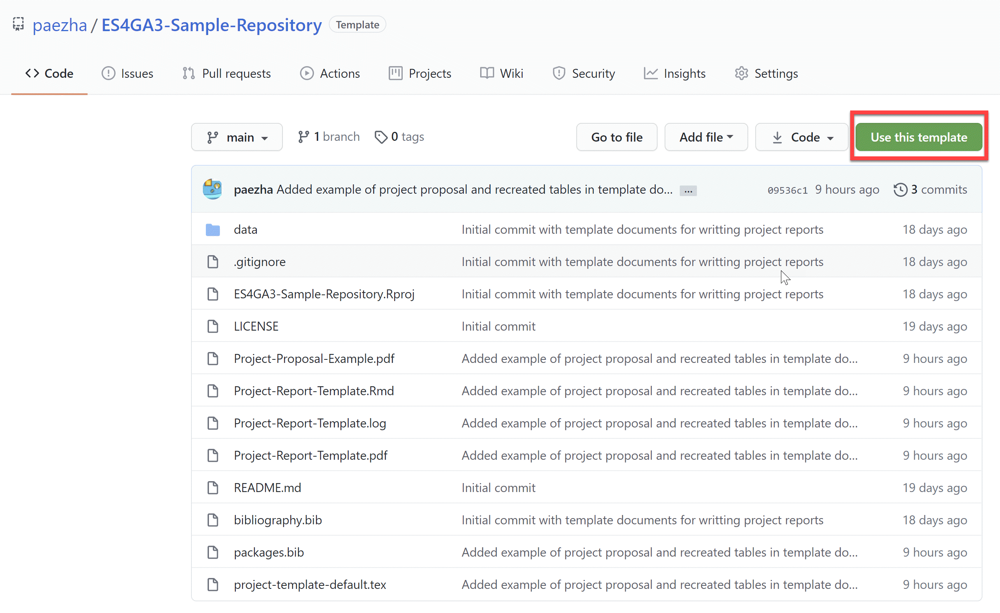
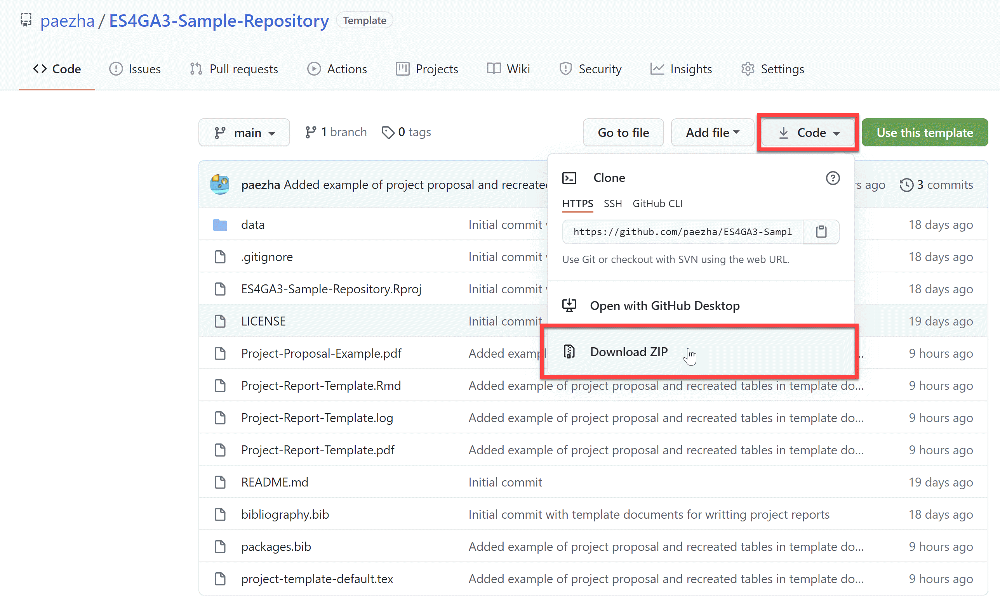
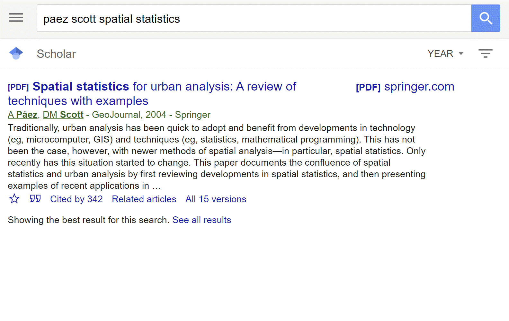
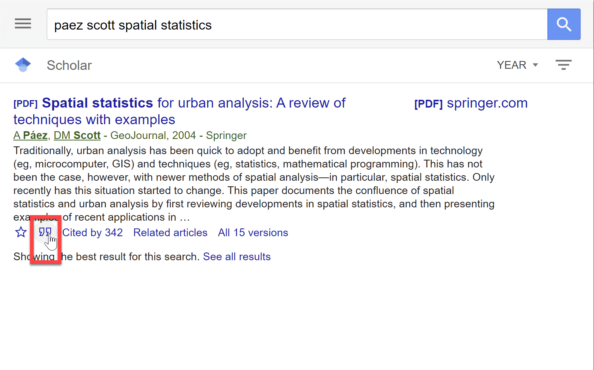
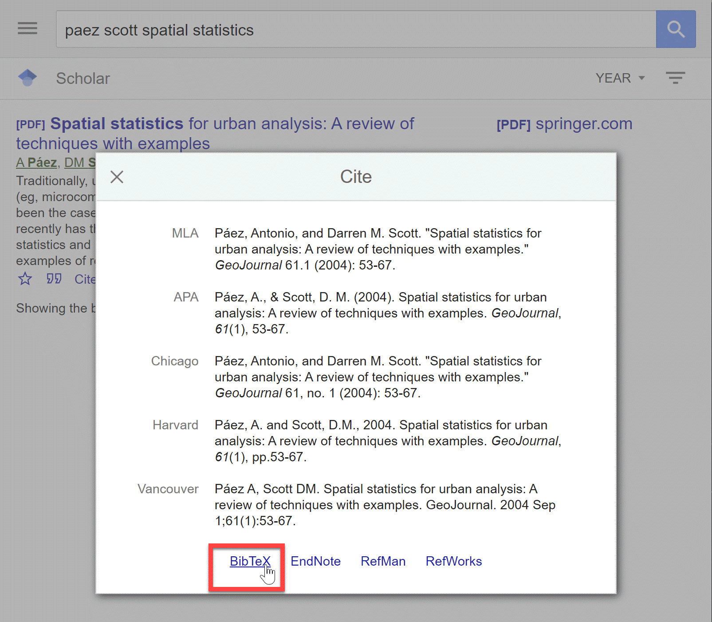

# ES4GA3-Sample-Repository

This repository provides a sample of a student project developed as part of the course ENVSOCTY 4GA3 Applied Spatial Statistics. It can also be used as a template to create a new project repository.  
  
## How to use it?

To use this repository as a template, you will need a GitHub account. If you would like to read a quick introduction to the use of GitHub to collaborate with others on a project, check this out:

https://github.com/paezha/Reproducible-Research-Workflow/tree/master/Session-03-Git-and-GitHub

Creating a repository using this as a template is as easy as a click of a button:

The owner of the new repository can invite others to collaborate.

Using the repository as a template is an option to work with others in your project, but not the only one. If you prefer working offline, or by email, using Google Drive, Microsoft One Drive, or share your project files in any other way, you can still benefit from the files in this repository. Simply download the files in the repository and use whatever you need.

"Using whatever you need" means that. You might want to work on your project in R markdown (which I highly recommend because it can be used to create your final report, as explained below). But if you prefer to write your report in Word, or Google Documents, or whatever, you might only want to browse some of the files to see an example of a project proposal and a project report.

## Getting started with the project

This repository has a number of files that you can use to get inspired for your project and that will give you a sense of the expectations. In addition, you can use some of the files as templates for your own project.

If you decide to use this repository as a template, the folder structure proposed is simple: you just need a folder to put your data. You can safely ignore the folder `_figures`; it contains the figures used by this README. You can also ignore the README.md file. Or, as an alternative, you could use the README file as a cover for your project (you can always point to it in your CV, for example), and then put any figures that your README.md file uses in `_figures`.

### Project proposal  

You might begin by browsing the file [`Project-Proposal-Example.pdf`](https://github.com/paezha/ES4GA3-Sample-Repository/blob/09536c122a86fd197860620a7492caa3964f634c/Project-Proposal-Example.pdf).  

This project proposal was created by former students Zahra Akhtar, Anastasiia Kalinina, Gabriella Morrone, Jillian Walters, and Jocelyn Wu. It proposed a spatial analysis of opioid pill prescriptions at the level of counties in the United States.  
The elements of the proposal are as follows:

1. Cover Page

With title of proposal, name and code of course, and name and student numbers of group members

2. Context for Proposal (500 words max)

A brief literature review to position the project within the body of knowledge. You should consult at least 10 sources (papers, book chapters, reports) to prepare this section of the proposal.

3. Objective of project (700 words max)

What is (are) the research question(s) that you aim to answer? Pose the question(s) in a form that is amenable to statistical testing. What will you know at the end of the project that you did not know at the beginning? Why should we care?

4. Data (as many words as needed)

Which data will you use for the project? What is (are) the source(s) of data? Describe the variables of interest, and how they relate to your research question.

5. Anticipated Findings (300 words max)

Describe the anticipated findings and their relevance.

6. List of References (as many words as needed)

List all the sources that are cited in the proposal.

This particular proposal earned a perfect grade: 100/100.

### Sample project  

The project report was written in R markdown. You can see the file [here](https://github.com/paezha/ES4GA3-Sample-Repository/blob/09536c122a86fd197860620a7492caa3964f634c/Project-Report-Template.Rmd).

The R markdown file has numerous useful examples to help you create a beautiful report. The output file (after knitting) is [here](https://github.com/paezha/ES4GA3-Sample-Repository/blob/09536c122a86fd197860620a7492caa3964f634c/Project-Report-Template.pdf).

You can use the `Project-Report-Template.Rmd` file directly: just save it with a different name and that becomes your working document. You can change the title, the names of the authors, student numbers, abstract, and so on by editing the header of the file. When you want to render the output file (i.e., create the pdf file), just knit the R markdown document.

The companion files for the R markdown document are files `project-template-default.tex` and `bibliography.bib`. Remember to keep these two files in the same folder where you keep you R markdown document.

The `bibliography.bib` file is where you save your references. You can obtain references in `bib` format easily from Google Scholar and other literature search engines (e.g., Web of Science). An example of this is shown in the figures below:

Simply copy and paste the citation in bibtex format to your `bibliography.bib` file, and you are ready to cite it in your R markdown document. See the examples there.

The final report in the example by Akhtar, Kalinina, Morrone, Walters, and Wu earned a 91/100, and would have been a 100/100 if they had done a spatial analysis of the residuals of their model, with a discussion and any corrective measures neeeded.